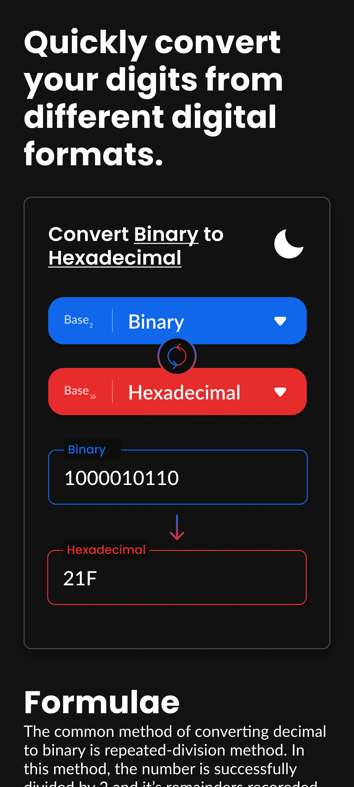
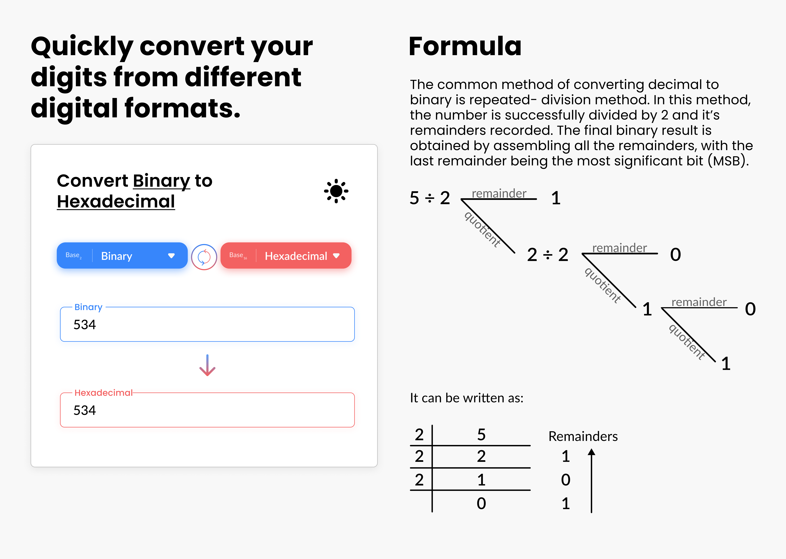

# Digi Convertor

A mini-project convertor, that takes a digital value as input like decimal/binary/octal/hexadecimal and converts it into its counterpart using python algorithms for the same. Also provides a demo formula for some of the conversions.

# Preview

# Todo

- [] Add intro animation
- [] Storing dark theme

# Design Decisions to Consider

- [] Highlighting the texts in the heading
