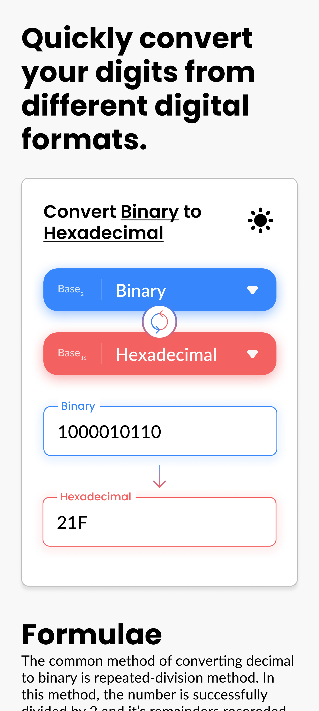

# Digi Convertor

A React/Vite front-end that converts numbers between binary, decimal, octal, and hexadecimal while showing the formulas behind each conversion.

## What it does
- Converts numbers between supported bases via a backend API
- Validates input digits per base before converting
- Displays conversion formulas and examples that match the selected types
- Lets users copy the converted value and toggle light/dark themes

## Key features
- Conversion UI: base selectors, reverse button, and input/converted fields
- Validation: blocks invalid digits and shows warnings via notifications
- Formula panel: type-specific conversion explanations and visuals
- Theme: light/dark toggle persisted in `localStorage`
- Clipboard: click the converted value to copy
- Motion: page-load transitions (framer-motion), dropdown animation (GSAP), and typed header text
- Responsive styling: layout adjustments in `src/media-queries.css`

## Tech stack
- React 18 + TypeScript
- Vite 3
- Recoil (state)
- framer-motion, GSAP, typed.js, animate.css (animations)
- react-notifications-component (toasts)

## Architecture overview
This repo contains the front-end only. The UI calls a separate conversion API and renders formula explanations locally based on the selected types.

The API contract expected by the UI:
- `GET /convert/{fromType}/{toType}/{value}`
- JSON response includes `value` and `msg`
- `fromType`/`toType` values: `Binary`, `Decimal`, `Octal`, `Hexadecimal`

```
Browser
  |
  v
React UI (this repo) --fetch--> Conversion API (separate service)
  |                                   |
  |<----------- JSON { value } --------|
  |
  v
Formula panel + converted output
```

## Getting started (local)

### Prerequisites
- Node.js and npm (package lock present)

### Install
```bash
npm install
```

### Environment variables
Create a `.env` file in the repo root:
```bash
VITE_API=https://your-api-base-url/
```
`VITE_API` must include the trailing `/` because the UI concatenates `convert/...` directly.

### Run
```bash
npm run dev
```
Optional: `npm run dev-host` to bind the dev server to your network.

## Usage
- Pick the input base (Binary/Decimal/Octal/Hexadecimal)
- Pick the output base
- Enter a value in the input field; the converted result updates
- Click the converted value to copy it
- Review the formula panel for the selected conversion

## Testing / Quality
No automated tests, lint, or format scripts are defined in `package.json`.

## Deployment
Deployed via Vercel. The build command is:
```bash
npm run build
```

## Project status / Roadmap
Status: Archived on GitHub; no further development planned.

Roadmap (completed, now deprecated due to archive):
- Intro animations (implemented via framer-motion/typed.js)
- Theme persistence (stored in `localStorage`)

## Design mockups



